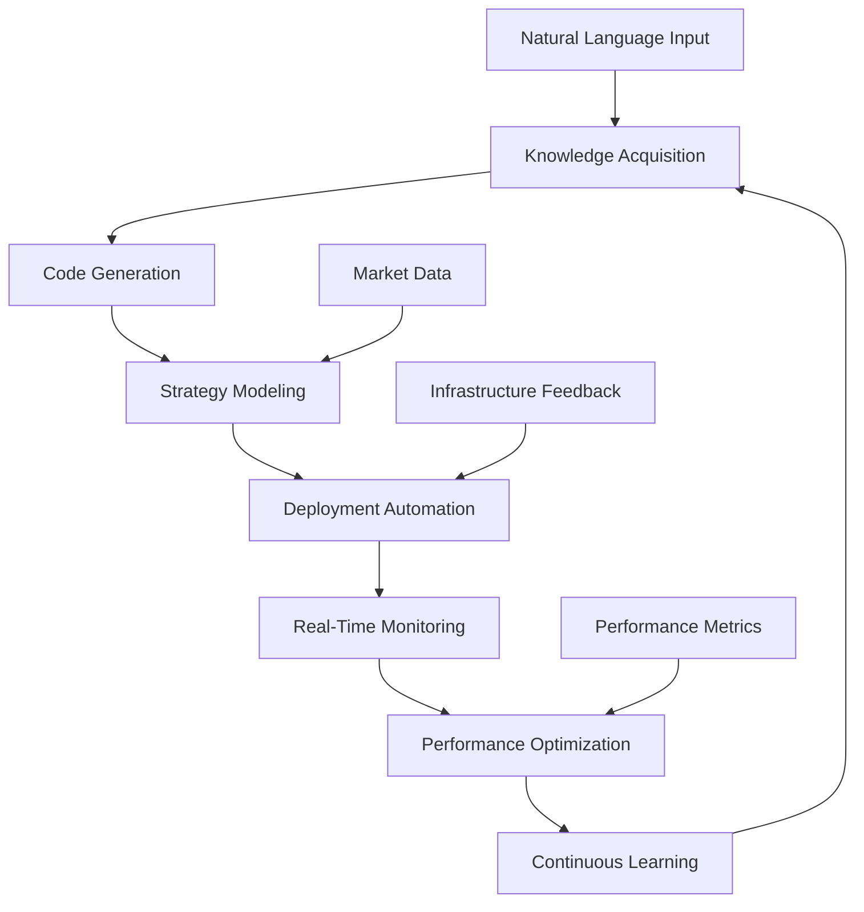

# AI-Powered Automation Framework for HFT Systems

This framework provides end-to-end AI-driven automation for high-frequency trading system development, deployment, and optimization. The system integrates knowledge acquisition, code generation, strategy modeling, deployment automation, and real-time monitoring into a seamless workflow.

## 🚀 Core Components

### 1. Knowledge Acquisition (`knowledge-acquisition/`)
- **AI Learning Engine**: Multi-model knowledge extraction and synthesis
- **Curriculum Generation**: Structured learning paths for HFT development
- **Source Integration**: Research papers, documentation, and best practices

### 2. Code Generation (`code-generation/`)
- **Schema-Driven Generator**: YAML-to-code transformation using AI
- **Multi-Language Support**: C++20, Python 3.11+, Rust
- **Performance Optimization**: Ultra-low latency code patterns

### 3. Strategy Modeling (`strategy-modeling/`)
- **AI Strategy Engine**: Automated strategy development and optimization
- **Backtesting Framework**: Historical performance validation
- **Multi-Objective Optimization**: Bayesian optimization with Optuna

### 4. Deployment Automation (`deployment-automation/`)
- **AI Deployer**: Natural language to infrastructure code
- **Real-Time Monitor**: Performance monitoring and optimization
- **Container Orchestration**: Kubernetes with ultra-low latency tuning

### 5. End-to-End Orchestrator (`orchestrator.py`)
- **Workflow Management**: Complete automation pipeline
- **Interactive Interface**: User-friendly workflow control
- **Integration Layer**: Seamless component coordination

## 🎯 Key Features

### Intelligent Automation
- **Natural Language Processing**: Deploy systems using plain English prompts
- **Multi-Model AI**: GPT-4, Claude, Gemini integration for optimal results
- **Adaptive Learning**: Continuous improvement from market data and performance

### Ultra-Low Latency Focus
- **Nanosecond Precision**: Sub-microsecond latency targeting
- **Hardware Optimization**: FPGA, DPDK, SR-IOV integration
- **Real-Time Monitoring**: Live performance tracking and optimization

### Production-Ready Infrastructure
- **Cloud-Native**: Kubernetes, Docker, Terraform automation
- **Security Hardened**: Zero-trust architecture and compliance
- **Scalable Design**: Auto-scaling based on market conditions

## 🚀 Quick Start

### Installation
```bash
# Clone and navigate to the HFT system
cd /workspaces/automated-hft-system/ai-automation

# Install dependencies
pip install -r requirements.txt

# Set up environment variables
export OPENAI_API_KEY="your-key"
export ANTHROPIC_API_KEY="your-key"
export PROMETHEUS_URL="http://localhost:9090"
```

### Full Automation Workflow
```bash
# Run complete end-to-end automation
python orchestrator.py

# Or run in interactive mode
python orchestrator.py --interactive
```

### Individual Components
```bash
# Knowledge acquisition
python knowledge-acquisition/ai_learning_engine.py

# Code generation
python code-generation/schema_driven_generator.py

# Strategy optimization
python strategy-modeling/ai_strategy_engine.py

# Deployment automation
python deployment-automation/ai_deployer.py

# Real-time monitoring
python deployment-automation/realtime_monitor.py
```

## 🔄 Automation Workflow



## 📊 End-to-End Example

### 1. Natural Language Request
```text
"Create a market-making strategy for EUR/USD with 100ns latency target, 
deploy to NY4 colocation, and monitor performance in real-time"
```

### 2. Automated Processing
```python
# Orchestrator handles the complete workflow
orchestrator = AIAutomationOrchestrator()

# Knowledge acquisition phase
learning_results = await orchestrator.run_learning_phase([
    "Market making strategies",
    "EUR/USD microstructure", 
    "Nanosecond latency optimization"
])

# Code generation phase
code_results = await orchestrator.run_code_generation_phase([
    "market-data-handler",
    "order-execution-engine", 
    "market-making-strategy"
])

# Strategy optimization phase
strategy_results = await orchestrator.run_strategy_optimization_phase([
    "market-making"
])

# Deployment phase
deployment_results = await orchestrator.run_deployment_phase("""
    Action: Deploy
    Component: MarketMakingEngine
    Environment: Production
    LatencyTolerance: 100ns
    Servers: [NY4-Colo-1, NY4-Colo-2]
""")

# Monitoring phase
await orchestrator.start_monitoring_phase()
```

### 3. Generated Output
- **C++ Trading Engine**: Ultra-low latency market making implementation
- **Python Control Interface**: Strategy configuration and monitoring
- **Kubernetes Manifests**: Production deployment configuration
- **Terraform Infrastructure**: AWS/GCP cloud setup
- **Monitoring Dashboard**: Real-time performance visualization

## 🛠️ Component Deep Dive

### Knowledge Acquisition Engine
```python
# Multi-source learning with curriculum generation
engine = AILearningEngine()

# Learn from research and implementations
knowledge = await engine.learn_from_sources([
    "Latest market microstructure research",
    "FPGA acceleration patterns",
    "Memory optimization techniques"
])

# Generate structured curriculum
curriculum = await engine.generate_curriculum(
    "Ultra-low latency trading system development"
)
```

### Schema-Driven Code Generator
```yaml
# Example component schema
name: execution-engine
type: hft_component
version: "1.0"

modules:
  - name: core
    language: cpp20
    features:
      - lock_free_queues
      - memory_pools
      - cpu_affinity
      - numa_aware

performance:
  latency_target_ns: 100
  throughput_target_ops: 1000000
  memory_limit_mb: 1024
```

```python
# Generate code from schema
generator = SchemaGenerator()
result = await generator.generate_from_schema(
    "schemas/execution-engine.yaml",
    "generated/execution-engine"
)
```

### AI Strategy Engine
```python
# Strategy optimization with backtesting
engine = AIStrategyEngine()

# Define strategy configuration
config = {
    'name': 'adaptive-market-making',
    'parameters': {
        'spread_bps': {'min': 0.1, 'max': 2.0},
        'inventory_limit': {'min': 100, 'max': 10000},
        'risk_factor': {'min': 0.01, 'max': 0.1}
    },
    'objectives': {
        'maximize': ['pnl', 'sharpe_ratio'],
        'minimize': ['max_drawdown', 'latency']
    }
}

# Run optimization and backtesting
optimization = await engine.optimize_strategy(config)
backtest = await engine.run_backtest(config['name'], optimization['best_params'])
```

### Deployment Automation
```python
# Natural language to infrastructure
orchestrator = DeploymentOrchestrator()

# Parse deployment requirements
config = DeploymentConfig.from_prompt("""
    Deploy trading engine to production with:
    - 200ns latency tolerance
    - NY4 and LD4 colocation
    - 16 CPU cores, 64GB RAM
    - SR-IOV networking
    - Real-time kernel
""")

# Generate and execute deployment
result = await orchestrator.execute_deployment(config)
```

### Real-Time Monitoring
```python
# Comprehensive performance monitoring
monitor = RealTimeMonitor(update_interval=0.1)  # 100ms updates

# Start live dashboard
await monitor.start_monitoring()

# Custom alert handlers
async def latency_alert_handler(alert):
    if alert['severity'] == 'critical':
        await optimizer.apply_emergency_tuning()
        await notification.send_alert(alert)

monitor.alert_manager.add_alert_rule(AlertRule(
    name="UltraHighLatency",
    metric="latency_p99_ns", 
    threshold=500,  # 500ns
    operator="gt",
    duration_seconds=5,
    severity="critical",
    callback=latency_alert_handler
))
```

## 🎯 Performance Targets

### Latency Benchmarks
- **Market Data Processing**: < 50ns
- **Order Execution**: < 100ns
- **Strategy Computation**: < 200ns
- **End-to-End**: < 500ns

### Throughput Targets
- **Market Data**: > 10M updates/sec
- **Order Processing**: > 1M orders/sec
- **Strategy Signals**: > 100K signals/sec

### Resource Efficiency
- **CPU Utilization**: < 80% under normal load
- **Memory Usage**: < 60GB for complete system
- **Network Bandwidth**: < 1Gbps per strategy

## 🔧 Configuration

### Environment Variables
```bash
# AI Model Configuration
export OPENAI_API_KEY="your-openai-api-key"
export ANTHROPIC_API_KEY="your-anthropic-api-key"
export GOOGLE_API_KEY="your-google-api-key"

# Infrastructure Configuration  
export AWS_REGION="us-east-1"
export KUBERNETES_NAMESPACE="hft-production"
export PROMETHEUS_URL="http://localhost:9090"
export GRAFANA_URL="http://localhost:3000"

# Performance Configuration
export LATENCY_TARGET_NS="200"
export THROUGHPUT_TARGET_OPS="1000000"
export AUTO_OPTIMIZATION_ENABLED="true"
```

### Workflow Configuration
```yaml
# ai-automation/configs/workflow.yaml
automation:
  knowledge_acquisition:
    enabled: true
    sources: ["arxiv", "github", "documentation"]
    update_interval_hours: 24
    
  code_generation:
    enabled: true
    languages: ["cpp20", "python311", "rust"]
    optimization_level: "ultra_performance"
    
  strategy_modeling:
    enabled: true
    optimization_method: "bayesian"
    backtest_period_days: 30
    
  deployment:
    auto_deploy: false  # Require manual approval
    environment: "staging"  # Default environment
    monitoring_enabled: true
    
  monitoring:
    update_interval_ms: 100
    alert_channels: ["slack", "email", "webhook"]
    auto_optimization: true
```

## 🚀 Advanced Usage

### Custom AI Models
```python
# Add custom AI model for specialized tasks
from ai_automation.knowledge_acquisition.ai_learning_engine import AILearningEngine

engine = AILearningEngine()

# Add custom model for financial analysis
engine.add_custom_model(
    name="FinancialGPT",
    api_endpoint="https://api.custom-model.com",
    model_id="financial-gpt-v3",
    specialization="quantitative_finance"
)

# Use for domain-specific learning
result = await engine.learn_with_model(
    "FinancialGPT",
    "Analyze market microstructure for EUR/USD during London session"
)
```

### Custom Strategy Templates
```yaml
# strategy-modeling/templates/custom-arbitrage.yaml
name: statistical-arbitrage
type: pairs_trading
description: AI-optimized statistical arbitrage strategy

parameters:
  lookback_window:
    type: integer
    range: [20, 200]
    default: 60
  
  entry_threshold:
    type: float
    range: [1.5, 3.0]
    default: 2.0
    
  exit_threshold:
    type: float  
    range: [0.2, 1.0]
    default: 0.5

objectives:
  primary: maximize_sharpe_ratio
  secondary: minimize_max_drawdown
  constraints:
    - max_leverage: 3.0
    - max_correlation: 0.8
```

### Custom Deployment Templates
```python
# deployment-automation/templates/custom_infrastructure.py
class CustomInfrastructureTemplate:
    """Custom infrastructure template for specialized deployments"""
    
    def __init__(self, provider: str = "aws"):
        self.provider = provider
        
    async def generate_bare_metal_config(self, specs: dict) -> str:
        """Generate bare metal server configuration"""
        return f"""
        # Bare metal configuration for ultra-low latency
        servers:
          - type: dell_r750
            cpu: intel_xeon_platinum_8380
            cores: {specs['cpu_cores']}
            memory: {specs['memory_gb']}GB_ddr4_3200
            network: mellanox_cx6_100g
            storage: nvme_ssd_array
            
        network:
          topology: spine_leaf
          latency_target: {specs['latency_target_ns']}ns
          bandwidth: {specs['bandwidth_gbps']}Gbps
        """
```

## 📈 Monitoring and Analytics

### Real-Time Dashboards
- **Trading Performance**: P&L, Sharpe ratio, maximum drawdown
- **System Performance**: Latency distribution, throughput, error rates  
- **Infrastructure Health**: CPU, memory, network, disk utilization
- **Market Conditions**: Volatility, spreads, volume patterns

### Automated Reporting
```python
# Generate daily performance report
report = await monitor.generate_performance_report()

# Key metrics included:
# - Latency statistics (P50, P95, P99, P99.9)
# - Throughput analysis  
# - Error rate trends
# - Resource utilization
# - Strategy performance
# - Infrastructure costs
```

### Predictive Analytics
```python
# AI-powered performance prediction
predictor = PerformancePredictor()

# Predict system performance under different market conditions
prediction = await predictor.forecast_performance(
    market_conditions={
        'volatility': 'high',
        'volume': 'above_average', 
        'session': 'london_open'
    },
    time_horizon_minutes=30
)
```

## 🔒 Security and Compliance

### Security Features
- **API Key Management**: Secure credential storage and rotation
- **Network Isolation**: VPC and security group constraints
- **Container Security**: Non-root users and read-only filesystems
- **Audit Logging**: Comprehensive activity tracking

### Compliance Support
- **MiFID II**: Transaction reporting and best execution
- **GDPR**: Data privacy and consent management  
- **SOX**: Financial controls and audit trails
- **FINRA**: Market surveillance and reporting

## 🧪 Testing and Validation

### Automated Testing Pipeline
```bash
# Run complete test suite
make test-all

# Individual test suites
make test-knowledge-acquisition
make test-code-generation  
make test-strategy-modeling
make test-deployment-automation
make test-monitoring
```

### Performance Validation
```python
# Latency validation tests
async def test_end_to_end_latency():
    """Validate end-to-end latency meets targets"""
    
    # Market data to signal latency
    md_latency = await measure_market_data_latency()
    assert md_latency < 50_000  # 50μs
    
    # Signal to order latency  
    signal_latency = await measure_signal_to_order_latency()
    assert signal_latency < 100_000  # 100μs
    
    # Order to fill latency
    fill_latency = await measure_order_to_fill_latency() 
    assert fill_latency < 200_000  # 200μs
```

## 🛣️ Roadmap

### Current Version (1.0)
- ✅ Core automation framework
- ✅ Multi-model AI integration
- ✅ Schema-driven code generation
- ✅ Strategy optimization engine
- ✅ Deployment automation
- ✅ Real-time monitoring

### Next Release (1.1)
- 🔄 Advanced strategy templates
- 🔄 Multi-asset class support
- 🔄 Enhanced ML models
- 🔄 Blockchain integration
- 🔄 Alternative data sources

### Future Releases (2.0+)
- 🎯 Quantum computing integration
- 🎯 Advanced AI agents
- 🎯 Cross-venue optimization
- 🎯 Regulatory automation
- 🎯 ESG compliance tools

## 🤝 Contributing

### Development Setup
```bash
# Clone repository
git clone https://github.com/your-org/automated-hft-system.git
cd automated-hft-system/ai-automation

# Create development environment
python -m venv venv
source venv/bin/activate
pip install -r requirements-dev.txt

# Run pre-commit hooks
pre-commit install
```

### Code Guidelines
- Follow PEP 8 for Python code
- Use type hints for all functions
- Include comprehensive docstrings
- Write unit tests for new features
- Document API changes

## 📞 Support

### Documentation
- [API Reference](docs/api-reference.md)
- [Architecture Guide](docs/architecture.md)  
- [Deployment Guide](docs/deployment.md)
- [Troubleshooting](docs/troubleshooting.md)

### Community
- [GitHub Issues](https://github.com/your-org/automated-hft-system/issues)
- [Discussion Forum](https://github.com/your-org/automated-hft-system/discussions)
- [Discord Server](https://discord.gg/hft-automation)

### Professional Support
- Email: support@hft-automation.com
- Phone: +1-555-HFT-AUTO
- Enterprise: enterprise@hft-automation.com

## 📄 License

This project is licensed under the MIT License - see [LICENSE](LICENSE) file for details.

## 🙏 Acknowledgments

- OpenAI for GPT-4 integration
- Anthropic for Claude integration  
- Google for Gemini integration
- The HFT and quantitative finance community
- Open source contributors and maintainers

---

**Disclaimer**: This software is for educational and research purposes. Use in production trading environments requires thorough testing and risk management. Past performance does not guarantee future results.
