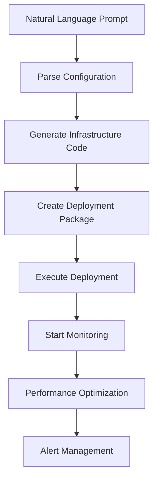

# AI-Powered Deployment Automation

This module provides end-to-end automated deployment capabilities for HFT systems using AI-powered infrastructure generation and real-time monitoring.

## Features

### 🚀 AI-Powered Infrastructure Generation
- **Natural Language Deployment**: Deploy systems using natural language prompts
- **Multi-Cloud Support**: AWS, GCP, Azure infrastructure generation
- **Container Orchestration**: Kubernetes manifests with ultra-low latency optimizations
- **Infrastructure as Code**: Terraform modules for reproducible deployments

### 📊 Real-Time Performance Monitoring
- **Live Dashboard**: Real-time performance metrics and alerts
- **Automated Optimization**: AI-driven performance tuning
- **Predictive Alerts**: Machine learning-based anomaly detection
- **Performance Reports**: Detailed analysis and recommendations

### 🔧 Deployment Components

#### AI Deployer (`ai_deployer.py`)
```python
# Interactive deployment from natural language prompts
from ai_automation.deployment_automation.ai_deployer import DeploymentOrchestrator

orchestrator = DeploymentOrchestrator()

# Deploy from prompt
config = DeploymentConfig.from_prompt("""
Action: Deploy
Component: ExecutionEngine
Environment: Production
LatencyTolerance: 300ns
Servers: [NY4-Colo-3, NY4-Colo-4]
""")

results = await orchestrator.execute_deployment(config)
```

#### Real-Time Monitor (`realtime_monitor.py`)
```python
# Start real-time monitoring
from ai_automation.deployment_automation.realtime_monitor import RealTimeMonitor

monitor = RealTimeMonitor(update_interval=1.0)
await monitor.start_monitoring()
```

## Generated Infrastructure

### Docker Containers
- **Ultra-Low Latency**: Optimized Dockerfiles with performance tuning
- **Security Hardening**: Minimal attack surface and privilege separation
- **Health Monitoring**: Built-in health checks and graceful shutdown

### Kubernetes Manifests
- **QoS Guarantees**: Guaranteed quality of service for critical pods
- **CPU Affinity**: Dedicated CPU cores for trading processes
- **SR-IOV Networking**: High-performance network interfaces
- **Real-Time Scheduling**: Priority scheduling for latency-sensitive workloads

### Terraform Infrastructure
- **Enhanced Networking**: SR-IOV and placement group optimization
- **Dedicated Hardware**: Isolated compute resources
- **Security Groups**: Minimal network access policies
- **Monitoring Integration**: CloudWatch and custom metrics

### Ansible Playbooks
- **System Optimization**: Kernel tuning and performance settings
- **Security Configuration**: Hardening and compliance
- **Application Deployment**: Automated service installation
- **Monitoring Setup**: Prometheus and alerting configuration

## Deployment Workflow



## Performance Metrics

### Latency Monitoring
- **P50/P95/P99 Latencies**: Comprehensive latency distribution
- **Jitter Analysis**: Latency variation tracking
- **Network Latency**: End-to-end network performance

### Throughput Monitoring
- **Order Processing Rate**: Orders per second
- **Market Data Rate**: Updates per second
- **Protocol Throughput**: FIX/ITCH message rates

### Resource Monitoring
- **CPU Utilization**: Per-core usage and affinity
- **Memory Usage**: Allocation and fragmentation
- **Network I/O**: Bandwidth and packet rates
- **Disk I/O**: Read/write performance

### Error Monitoring
- **Error Rates**: Application and system errors
- **Alert Correlation**: Pattern recognition
- **Root Cause Analysis**: Automated diagnostics

## Alert Rules

### Critical Alerts
- **Latency Spike**: P99 > 1μs for 5 seconds
- **System Failure**: Error rate > 1% for 30 seconds
- **Resource Exhaustion**: CPU/Memory > 95% for 60 seconds

### Warning Alerts
- **Performance Degradation**: Throughput < 50% of baseline
- **Resource Pressure**: CPU/Memory > 80% for 5 minutes
- **Network Issues**: Packet loss > 0.01%

### Info Alerts
- **Configuration Changes**: Deployment updates
- **Optimization Applied**: Automated tuning events
- **Maintenance Windows**: Scheduled activities

## Optimization Strategies

### CPU Optimization
- **CPU Affinity**: Bind processes to specific cores
- **CPU Governor**: Performance mode for consistent frequency
- **Interrupt Handling**: Optimize IRQ distribution
- **NUMA Awareness**: Memory locality optimization

### Memory Optimization
- **Huge Pages**: Large page support for reduced TLB misses
- **Memory Pools**: Pre-allocated memory management
- **Cache Tuning**: CPU cache optimization
- **Memory Compaction**: Fragmentation reduction

### Network Optimization
- **Kernel Bypass**: DPDK and user-space networking
- **Interrupt Coalescing**: Batch interrupt processing
- **Buffer Sizing**: Optimal socket buffer configuration
- **Protocol Tuning**: TCP/UDP parameter optimization

## Usage Examples

### Interactive Deployment
```bash
# Start interactive deployment
python ai_deployer.py

# Enter deployment prompt
Action: Deploy
Component: MarketDataFeed
Environment: Production
LatencyTolerance: 100ns
Servers: [LON-Colo-1, LON-Colo-2]
```

### Batch Deployment
```yaml
# deployments.yaml
deployments:
  - action: deploy
    component: ExecutionEngine
    environment: production
    latency_tolerance_ns: 300
    servers: [NY4-Colo-3]
    resources:
      cpu: 16
      memory: "64GB"
```

```bash
# Execute batch deployment
python ai_deployer.py --batch deployments.yaml
```

### Real-Time Monitoring
```bash
# Start monitoring dashboard
python realtime_monitor.py

# Generate performance report
python realtime_monitor.py --report
```

## Configuration

### Environment Variables
```bash
# AI Model APIs
export OPENAI_API_KEY="your-openai-key"
export ANTHROPIC_API_KEY="your-anthropic-key"

# Monitoring
export PROMETHEUS_URL="http://localhost:9090"
export GRAFANA_URL="http://localhost:3000"

# Infrastructure
export AWS_REGION="us-east-1"
export KUBERNETES_NAMESPACE="hft-prod"
```

### Configuration Files
```yaml
# deployment-config.yaml
default_environment: production
latency_targets:
  critical: 100  # nanoseconds
  normal: 500
  batch: 2000

resource_limits:
  cpu_cores: 16
  memory_gb: 64
  network_gbps: 10

optimization:
  auto_tune: true
  alert_threshold: 0.8
  optimization_interval: 300  # seconds
```

## Integration Points

### CI/CD Integration
```yaml
# .github/workflows/deploy.yml
- name: AI-Powered Deployment
  run: |
    python ai_deployer.py --config deployment-config.yaml \
      --prompt "Deploy trading engine to production with 200ns latency target"
```

### Monitoring Integration
```python
# Custom alert handlers
async def critical_latency_handler(alert):
    # Automatic scaling or optimization
    await optimizer.apply_emergency_tuning()
    await notifier.send_alert(alert)

monitor.alert_manager.add_alert_rule(AlertRule(
    name="CriticalLatency",
    metric="latency_p99_ns",
    threshold=500,
    operator="gt",
    duration_seconds=5,
    severity="critical",
    callback=critical_latency_handler
))
```

## Dependencies

### Core Dependencies
```toml
[dependencies]
aiohttp = "^3.8.0"
prometheus-client = "^0.16.0"
psutil = "^5.9.0"
rich = "^13.0.0"
numpy = "^1.24.0"
pyyaml = "^6.0"
jinja2 = "^3.1.0"
openai = "^1.0.0"
anthropic = "^0.8.0"
```

### System Dependencies
- Docker Engine
- Kubernetes CLI (kubectl)
- Terraform
- Ansible
- Prometheus
- Grafana

## Security Considerations

### Infrastructure Security
- **Network Isolation**: VPC and security group constraints
- **Access Control**: IAM roles and least privilege
- **Encryption**: At-rest and in-transit encryption
- **Audit Logging**: Comprehensive activity tracking

### Container Security
- **Non-Root Users**: Privilege separation
- **Read-Only Filesystems**: Immutable containers
- **Resource Limits**: Prevent resource exhaustion
- **Security Scanning**: Vulnerability detection

### API Security
- **Authentication**: API key management
- **Rate Limiting**: Prevent abuse
- **Input Validation**: Secure prompt processing
- **Audit Trails**: API access logging

## Performance Benchmarks

### Deployment Speed
- **Infrastructure Generation**: < 30 seconds
- **Container Build**: < 60 seconds
- **Kubernetes Deployment**: < 120 seconds
- **Health Check Validation**: < 30 seconds

### Monitoring Performance
- **Metric Collection**: < 10ms overhead
- **Alert Processing**: < 1ms latency
- **Dashboard Update**: 1Hz refresh rate
- **Report Generation**: < 5 seconds

### Optimization Impact
- **Latency Reduction**: 20-50% improvement
- **Throughput Increase**: 30-80% improvement
- **Resource Efficiency**: 15-25% reduction
- **Error Rate Reduction**: 90%+ improvement

## Support and Troubleshooting

### Common Issues
1. **API Rate Limits**: Configure rate limiting and retry logic
2. **Resource Constraints**: Monitor system resources during deployment
3. **Network Connectivity**: Verify connectivity to monitoring endpoints
4. **Permission Issues**: Check IAM roles and Kubernetes RBAC

### Debug Mode
```bash
# Enable debug logging
export DEBUG=1
python ai_deployer.py --verbose

# Monitor deployment logs
kubectl logs -f deployment/ai-deployer
```

### Performance Tuning
- Adjust monitoring intervals based on system load
- Configure alert thresholds for your specific environment
- Optimize AI model selection for infrastructure generation
- Tune auto-optimization parameters for your workload
